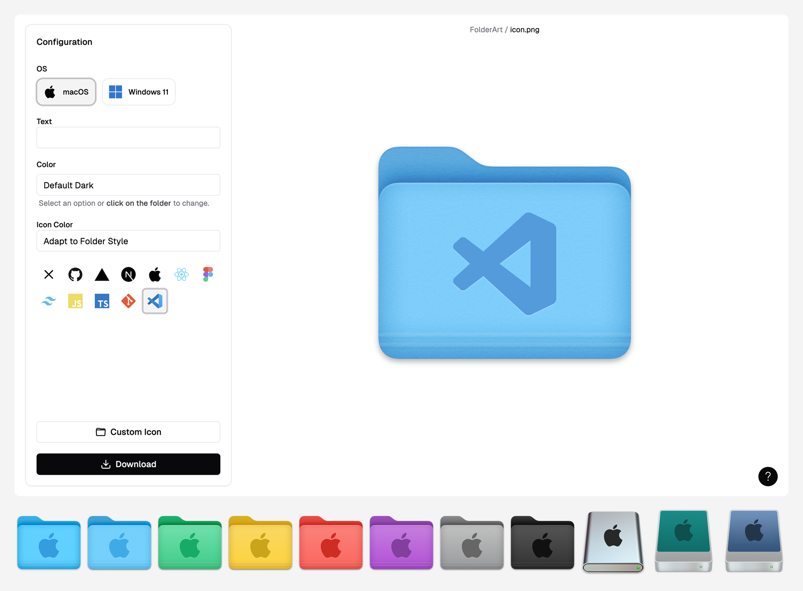

<h1 align="center">FolderArt</h1>

 <br />

<div align="center">

<p align="center">
    Create custom folder icons for macOS and Windows 11.
    <br />
    <a href="https://folderart.christianvm.dev"><strong>Live Demo »</strong></a>
    <br />
    <br />
</p>


</div>

<br />

### Features

-  [x] 💻 macOS and Windows 11 support
-  [x] 💬 Custom Text
-  [x] ⚛️ Default Icons
-  [x] 📁 Custom Icons
-  [x] 🎨 Change Folder Color
-  [x] 💻 Live Preview
-  [x] 🗳️ Download File

<br />

### Installation

1. Clone the repo

   ```sh
   git clone https://github.com/christianvmm/folderart.git
   ```

2. Install NPM packages

   ```sh
   npm install
   ```

3. Start Next.js server
   ```sh
   npm run dev
   ```

<br />

### Gallery

 <br />

 <br />
