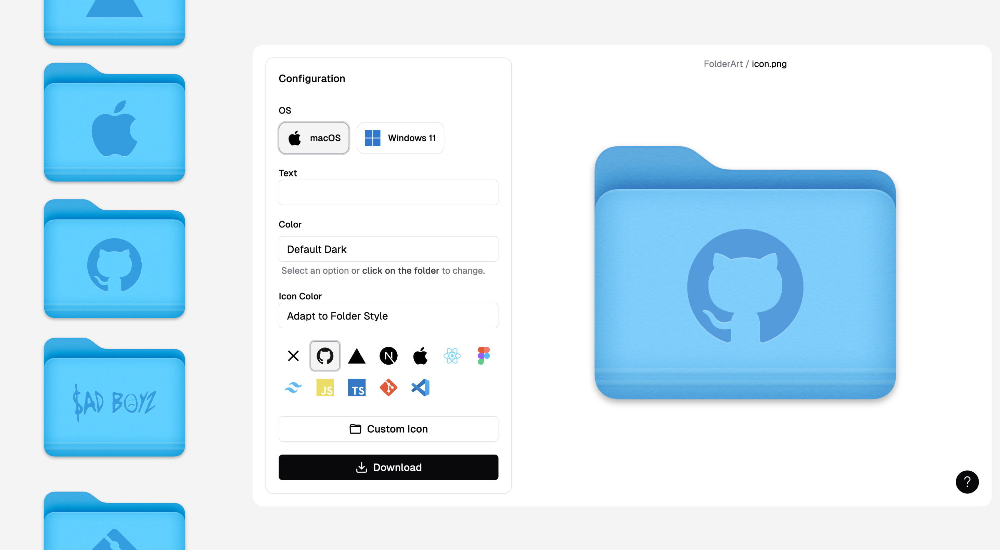

<h1 align="center">FolderArt</h1>

 <br />

<div align="center">

<p align="center">
    Create custom folder icons for macOS.
    <br />
    <a href="https://folderart.christianvm.dev"><strong>Live Demo »</strong></a>
    <br />
    <br />
</p>


</div>

<br />

### Installation

1. Clone the repo

   ```sh
   git clone https://github.com/christianvmm/folderart.git
   ```

2. Install NPM packages

   ```sh
   npm install
   ```

3. Start Next.js server
   ```sh
   npm run dev
   ```
